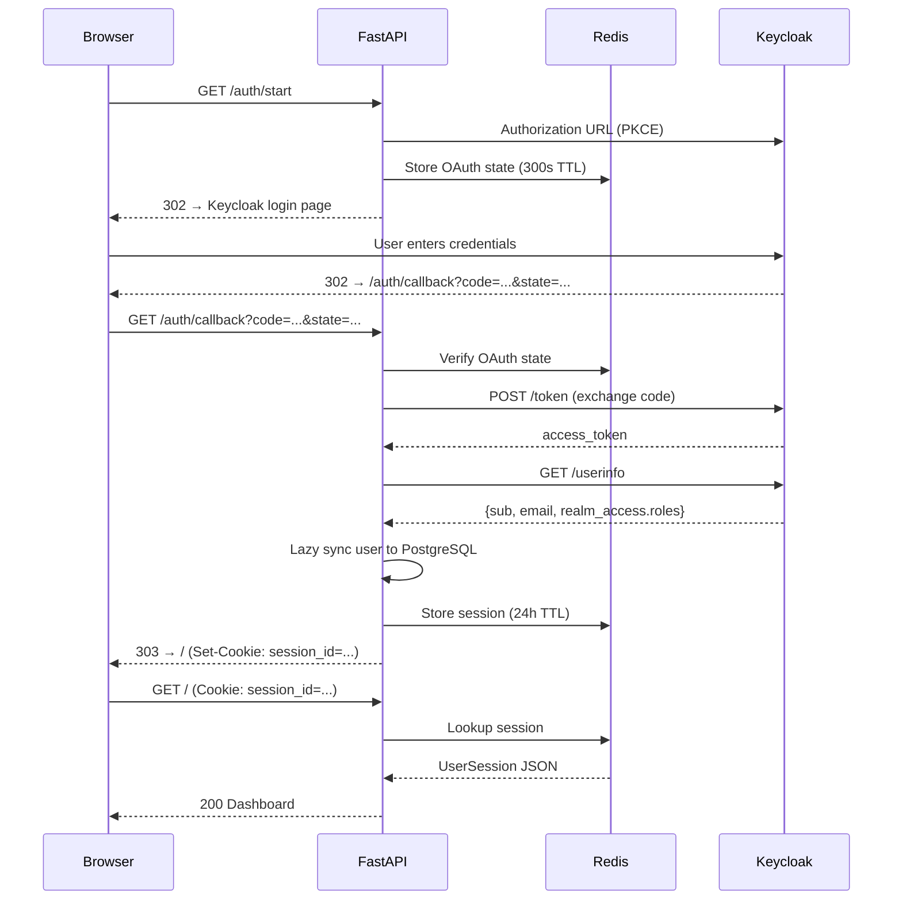

# Auth Layer — Overview

**Phase:** 3a · **Status:** Complete

---

## 1. Architecture

Keycloak OIDC Authorization Code flow with PKCE. Server-side sessions in Redis.
HTTP-only cookie. No JWT validation in the app — tokens are exchanged server-side
and never reach the browser.



## 2. Key design decisions

| Decision | Rationale |
|---|---|
| Session-based, not Bearer token | HTTP-only cookie is immune to XSS token theft. CLAUDE.md §3, §12. |
| Redis for sessions | Fast lookup on every request, automatic TTL expiry, shared across workers. |
| Lazy Keycloak sync | User/role created or updated in PostgreSQL on login only. No webhook infrastructure. CLAUDE.md §10, §12. |
| PKCE (S256) | Prevents authorization code interception. Standard for public/confidential clients. |
| `UserSession` dataclass, not ORM object | Session validation is Redis-only — no DB call per request. |
| Separate dependencies from auth service | `KeycloakAuthService` handles OIDC flow. `require_auth` handles session validation. Different concerns, different code paths. |
| Absolute TTL, no sliding expiration | Sessions expire at a fixed wall-clock time (`SESSION_TTL_SECONDS`). Not renewed on activity. **Accepted trade-off:** if a Keycloak account is disabled mid-session, the local Redis session remains valid until TTL expires. Post-MVP mitigation: add a Keycloak token introspection call on sensitive operations (admin actions, document upload). |
| `secure=False` for internal HTTP deployment | The `Secure` cookie attribute prevents the cookie being sent over plain HTTP. Internal deployments without TLS must set this to `False` or the cookie is silently dropped and every request appears unauthenticated. Set `secure=True` when behind Caddy/TLS. |

## 3. Three-layer CSRF protection

These three mechanisms are distinct and non-redundant — none substitutes for another:

| Layer | Protects against | Where |
|---|---|---|
| OAuth `state` parameter | Login-CSRF — attacker tricks victim's browser into completing an OAuth flow the attacker initiated | `app/services/auth.py` — state stored in Redis, verified on callback |
| PKCE `code_verifier` / `code_challenge` | Authorization code interception — attacker intercepts the code in transit and exchanges it themselves | `app/services/auth.py` — S256 challenge, verifier stored in Redis |
| Starlette CSRF middleware | Form CSRF — attacker tricks an already-authenticated user into submitting a state-changing form | `app/main.py` — token in every form, validated on POST |

| Layer | What | Where |
|---|---|---|
| Authentication | Valid session cookie → `UserSession` | `app/api/dependencies.py → require_auth` |
| Authorization (admin) | `is_admin=True` flag | `app/api/dependencies.py → require_admin` |
| Authorization (owner) | `is_owner=True` flag | `app/api/dependencies.py → require_owner` |
| CSRF | Starlette CSRF middleware, token in forms | `app/main.py` |
| Role-based retrieval | Qdrant filter at query time | `app/pipeline/nodes/node_03_parallel_qdrant_search.py` |

## 4. Module index

| Module | File | Doc | Status |
|---|---|---|---|
| Auth service (OIDC) | `app/services/auth.py` | [auth_service.md](auth_service.md) | Verified |
| Auth dependencies | `app/api/dependencies.py` | [auth_dependencies.md](auth_dependencies.md) | Verified |
| Error handlers | `app/api/error_handlers.py` | [auth_error_handling.md](auth_error_handling.md) | Verified |
| Integration tests | `tests/integration/test_auth_flow.py` | [auth_integration.md](auth_integration.md) | Verified |

## 5. Session lifecycle

```
Login:    /auth/start → Keycloak → /auth/callback → Redis session created → cookie set
Request:  Cookie → require_auth → Redis lookup → UserSession returned
Logout:   /auth/logout → Redis session deleted → cookie cleared → Keycloak logout
Expiry:   Redis TTL (24h default) → session auto-deleted → next request → require_auth raises → redirect to login
```

## 6. File map

```
app/core/security.py              BaseAuthService ABC + UserSession dataclass
app/core/exceptions.py            AuthenticationError, AuthorizationError
app/services/auth.py              KeycloakAuthService (OIDC, PKCE, lazy sync)
app/api/dependencies.py           require_auth, require_admin, require_owner
app/api/error_handlers.py         register_error_handlers (HTML/HTMX/JSON)
app/main.py                       Auth routes + CSRF middleware
app/core/settings.py              KEYCLOAK_URL, CLIENT_ID, SECRET_KEY, SESSION_TTL
```
