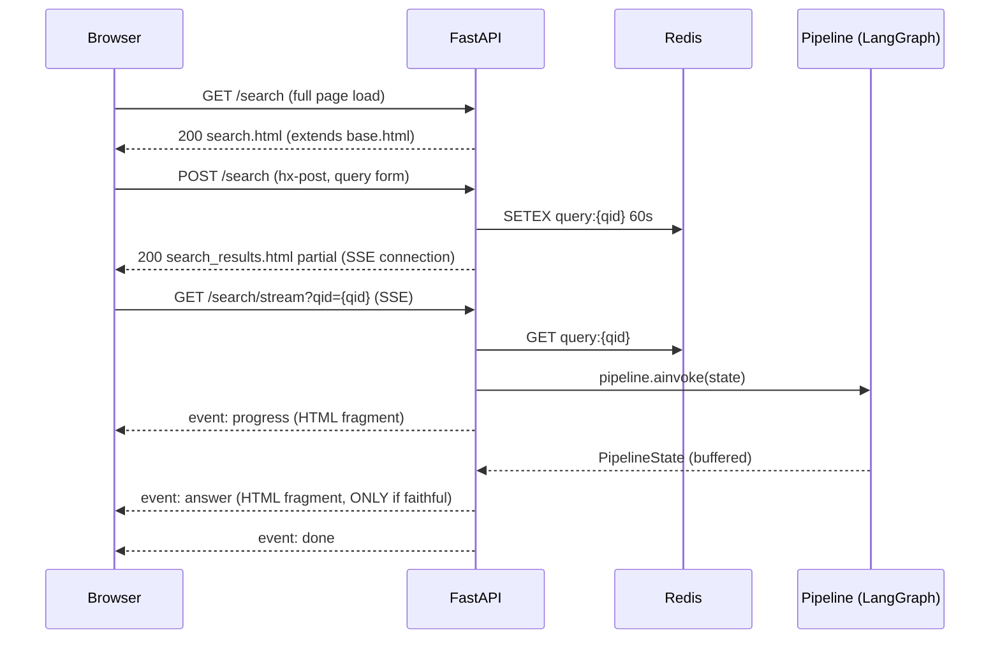

# Frontend Layer — Overview

**Phase:** 3b · **Status:** Complete

---

## 1. Architecture

HTMX + Jinja2 monolith served by FastAPI. No React, no npm, no separate frontend
process. Server-side rendering with targeted partial swaps via HTMX attributes.
SSE streaming for real-time pipeline progress and answer delivery.



## 2. Key design decisions

| Decision | Rationale |
|---|---|
| SSE, not WebSocket | CLAUDE.md §12 hard constraint. Unidirectional server→client is sufficient for pipeline output. |
| Buffered answer + faithfulness check before SSE | Answer is never streamed token-by-token. Full answer generated, verified, then sent as one event. §12 constraint. |
| HTML fragments over SSE (not JSON) | HTMX `sse-swap` expects HTML. No client-side rendering logic needed. |
| Query stored in Redis (qid pattern) | Avoids URL-encoding long queries. SSE endpoint reads by short UUID. 60s TTL auto-cleanup. |
| Component extraction | CLAUDE.md §17 rule 1: pages never contain reusable markup. Search bar, message bubble, source card all extracted. |
| Macros for form fields and buttons | Parameterized Jinja2 macros replace prop-based React components. Consistent styling without duplication. |
| Pipeline factory (composition root) | Single place that wires all 9 nodes with services. Route imports `get_compiled_pipeline(settings)` — no node-level wiring in routes. |

## 3. Template hierarchy

```
base.html                          Root layout — nav, HTMX, SSE extension, block head/content/footer
├── pages/search.html              Extends base, loads search.css, includes search_page_content
│   └── partials/search_page_content.html    Search bar + results target div
│       └── components/search_bar.html       Form with hx-post + hx-target
└── partials/search_results.html   SSE connection container (returned by POST /search)
    ├── div.message-user           User query display
    ├── div[sse-swap="progress"]   Progress indicator (swapped by SSE)
    ├── div[sse-swap="answer"]     Answer (swapped by SSE)
    │   └── components/message_bubble.html   Rendered server-side, sent as SSE data
    │       └── components/source_card.html  One per source filename
    └── div[sse-swap="error"]      Error fallback (swapped by SSE)
```

## 4. SSE event protocol

| Event | Data | Trigger |
|---|---|---|
| `progress` | `<div class="progress">Searching documents…</div>` | Pipeline started |
| `answer` | Rendered `message_bubble.html` with answer + source cards | `is_faithful=True` |
| `error` | `<div class="error-container"><p>...</p></div>` | `is_faithful=False` or pipeline exception |
| `done` | Empty string | Always last — signals client to close SSE connection |

## 5. Module index

| Module | Files | Doc | Status |
|---|---|---|---|
| Macros + base enhancements | `macros/forms.html`, `macros/buttons.html`, `base.html` | [frontend_macros.md](frontend_macros.md) | Verified |
| Landing + dashboard pages | `pages/landing.html`, `pages/dashboard.html`, `base.css` | [frontend_base_pages.md](frontend_base_pages.md) | Verified |
| Search route + SSE | `api/routes/search.py`, `pipeline/factory.py` | [search_route.md](search_route.md) | Verified |
| Search templates + CSS | `pages/search.html`, `partials/`, `components/`, `search.css` | [search_frontend.md](search_frontend.md) | Verified |

## 6. CSS structure

```
app/static/css/
├── base.css              Base layout, nav, buttons, badges, form styles
└── pages/
    └── search.css        Search-specific: message bubbles, source cards, progress, errors
```

No CSS framework. No preprocessor. Intentional — keeps the stack minimal and
avoids build tooling. Each page loads only its own CSS via ``.

## 7. File map

```
app/api/routes/search.py              Search router: GET /, POST /, GET /stream
app/api/routes/__init__.py            Exports search_router
app/pipeline/factory.py               Composition root: build_pipeline_nodes + get_compiled_pipeline
app/templates/base.html               Root layout: nav, HTMX 2.0.4, SSE extension, blocks
app/templates/pages/search.html       Search page (extends base, loads search.css)
app/templates/pages/landing.html        Public landing — Login button (btn macro, company branding)
app/templates/pages/dashboard.html    Dashboard (macros, admin/owner badges, search link)
app/templates/partials/search_page_content.html   Search bar + results div
app/templates/partials/search_results.html        SSE connection container
app/templates/components/search_bar.html          Reusable search form
app/templates/components/message_bubble.html      Answer bubble + source cards
app/templates/components/source_card.html         Single source filename display
app/templates/macros/forms.html       form_field(name, label, type, error, required, placeholder)
app/templates/macros/buttons.html     btn(text, variant, type, href, **kwargs)
app/static/css/base.css               Base styles
app/static/css/pages/search.css       Search page styles
```
