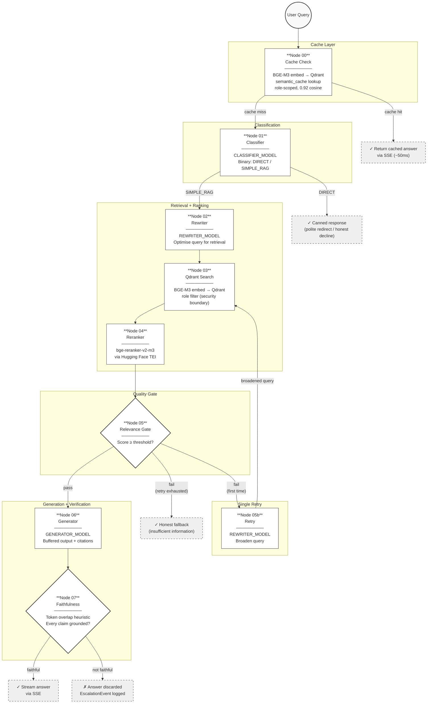

# Pipeline Graph — Visual Flow

## Reading the diagram

| Path | When | Latency |
|------|------|---------|
| Cache hit | Semantically equivalent query already answered for this role | ~50 ms |
| DIRECT | Chitchat, greetings, out-of-scope questions | < 50 ms |
| SIMPLE_RAG (happy) | Domain question, chunks found, answer faithful | ~2.3–4.3 s |
| Relevance retry | First search returns low-confidence chunks, broadened query retries | +1–2 s |
| Fallback | Both search attempts fail relevance threshold | ~1.5 s |
| Escalation | Generator produced ungrounded claims — answer discarded | same as happy path |

## Conditional routing logic

| After node | Condition | Next |
|------------|-----------|------|
| Cache Check | `cache_hit = True` | END (return cached answer) |
| Cache Check | `cache_hit = False` | Classifier |
| Classifier | `classification = "DIRECT"` | END (canned response) |
| Classifier | `classification = "SIMPLE_RAG"` | Rewriter |
| Relevance Gate | `relevance_pass = True` | Generator |
| Relevance Gate | `relevance_pass = False` and no retry yet | Retry |
| Relevance Gate | `relevance_pass = False` and `retry_attempted = True` | END (fallback) |
| Retry | always | Qdrant Search (re-enters retrieval) |
| Faithfulness | always | END (faithful → stream; not → escalate) |

## Key architectural notes

- **Security boundary** is at Node 03 — the Qdrant role filter ensures the LLM never sees chunks the user's role cannot access.
- **Buffered generation** — Node 06 output is held in memory, not streamed. SSE begins only after Node 07 confirms faithfulness.
- **Retry loops back to search** (Node 03), not to the rewriter. The retry node produces a broadened `rewritten_query` that re-enters the retrieval path.
- **No LLM cost** on the fast paths (cache hit, DIRECT, relevance fallback).
